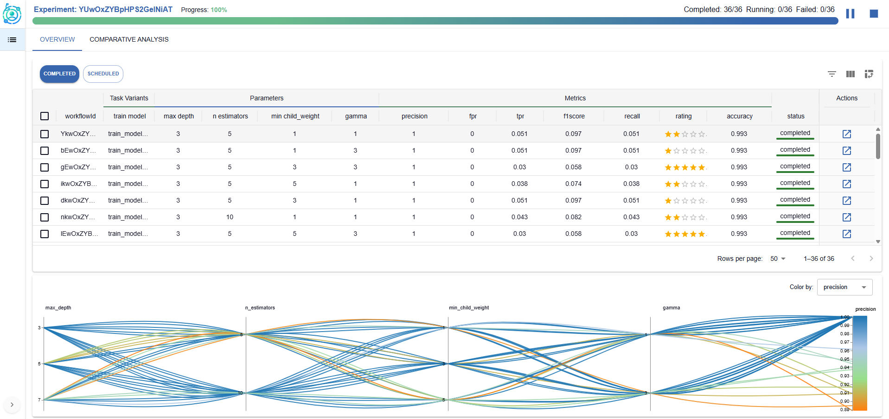

# **ExperimentLens**
### *Exploring, Monitoring, and Explaining complex AI pipelines*

## About ExperimentLens
**ExperimentLens** is a lightweight yet powerful visual dashboard for the interactive exploration, monitoring, and explainability of complex AI pipelines.

Developed within the context of the [ExtremeXP project](https://extremexp.eu/), ExperimentLens empowers researchers, data scientists, and engineers to make sense of experimental results across multiple runs and interconnected tasks.

The tool is centered on **human-in-the-loop experimentation**, enabling users to monitor pipeline lifecycles, inspect results, and gain insights into pipeline behavior and configuration sensitivity.

  
  

    ExperimentLens dashboard: analyzing configuration effects on experiment performance.
  

## Core Features
### Run and Configuration Analysis

- Compare metrics and outputs across multiple experiment runs.
- Analyze the effect of variability points (e.g., hyperparameters, engine configurations).
- Detect patterns, trends, and outliers across different pipeline variants.

### Pipeline Control and Human-in-the-Loop Feedback

- Monitor and steer pipeline executions at runtime, guided by intermediate results and visual feedback.
- Use diagnostic views to adjust configuration choices and re-launch modified pipelines.
- Support interactive refinement by integrating user feedback into the exploration process.

### Artifact and Data Inspection

- Preview input and output datasets, prediction results, and artifacts in rich visual formats.
- Context-aware inspection scoped to the task and pipeline level.

### Integrated Explainability

- Access both local and global post-hoc explanation techniques.
- Visualize results of explainability methods like counterfactual examples, Partial Dependence Plots (PDP), and Accumulated Local Effects (ALE).
- Link pipeline behavior to specific inputs, parameter settings, and structure.

## Components

**ExperimentLens** is composed of three main components that together enable interactive visual exploration and explainability of AI pipelines:

| **Component** | **Description** |
|----------------|----------------|
| [Visualization UI](https://github.com/extremexp-HORIZON/vis-frontend) | Interactive dashboard for exploring experiments, monitoring executions, and visualizing explainability results. |
| [Visualization Middleware (Backend)](https://github.com/extremexp-HORIZON/vis-api) | REST-based middleware connecting the UI to experiment tracking tools and orchestration frameworks. |
| [Explainability Module](https://github.com/extremexp-HORIZON/extremexp-explainability-module) | Provides local and global explainability methods (e.g., counterfactuals, PDP, ALE) and integrates results into the UI through the middleware. |

Each component repository includes its own setup and development instructions.

## Integrations

**ExperimentLens** integrates with existing experiment tracking and workflow orchestration systems to provide a unified view of experiment execution, monitoring, and analysis.

- **Experiment Tracking**
  - Connects to tools such as **MLflow** for logging metrics, parameters, and artifacts.
  - Currently supports **MLflow** and the **ExtremeXP Experimentation Engine**.

- **Workflow Orchestration**
  - Interfaces with workflow engines to monitor and control pipeline lifecycles, trace task execution, and adjust parameters dynamically.
  - Currently supports the **ExtremeXP Execution Engine**, with planned support for **Kubeflow**, **Airflow**, and other orchestration platforms.
